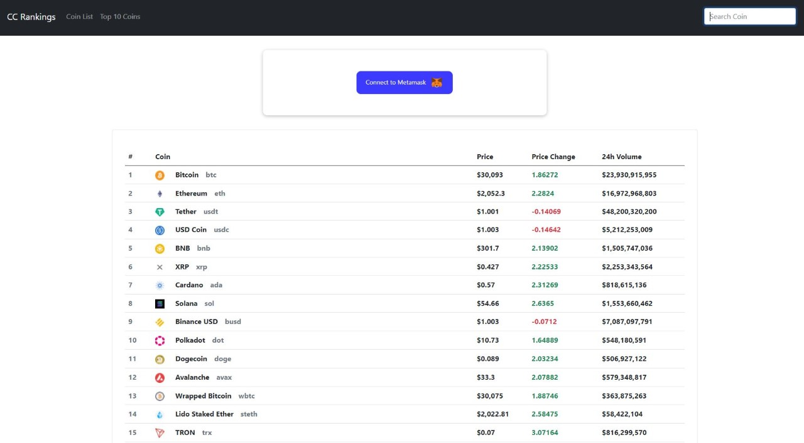
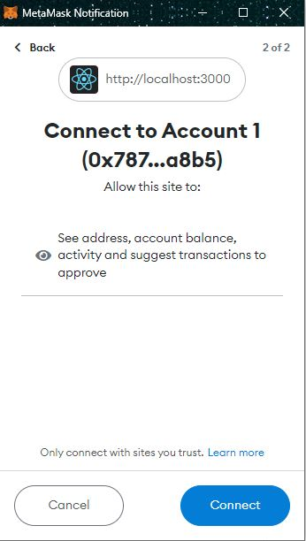
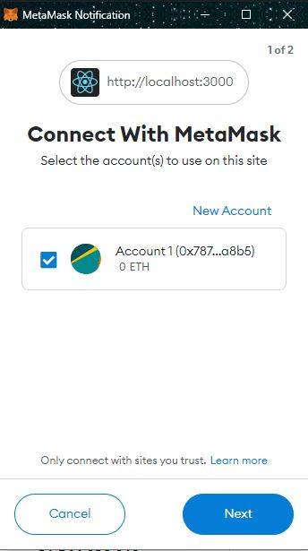
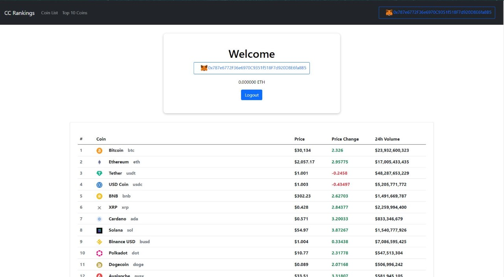

## React-Metamask-CoinChart-List
Metamask Auth API login with ETH currency and realtime coin price value using puppeteer from ReactJS

### Instructions
`Note:` Metamask Extension is required in order to use its full feature, recommended browser `chrome` 

1. Run Command `npm install` to install require packages.

2. Run Command `npm run start`

3. Application starts at `http://localhost:3000`

### Screenshots

* Chartlist

* Metamask Login Popup

* Eth Balance Popup

* Logged in user
